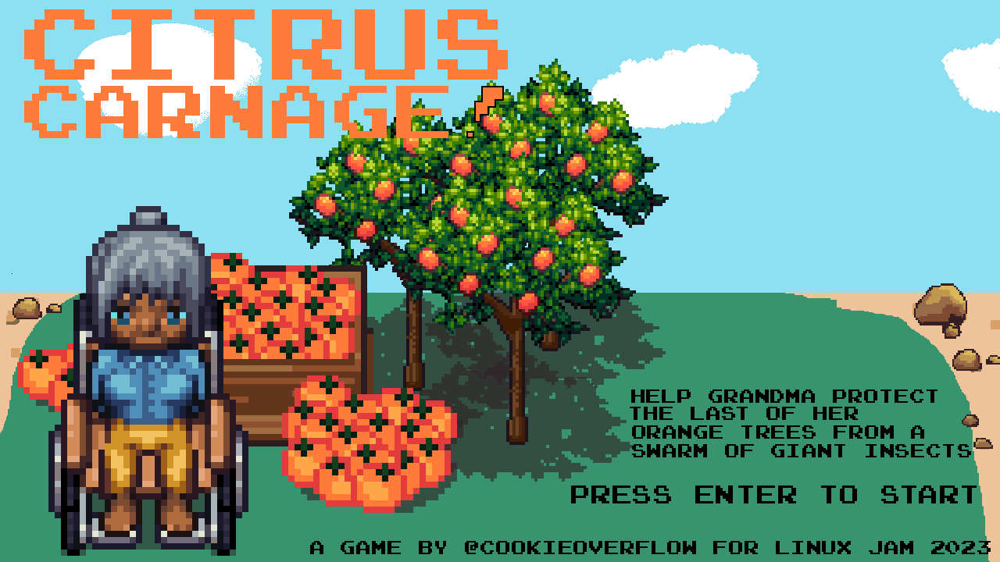

# Citrus Carnage

Entry for [Linux Game Jam 2023](https://itch.io/jam/linux-game-jam2023)

Inspired by the prompt orange and the genre twinsticks, Citrus Carnage is an action shooter game where your objective is to protect what's left of your orange trees.

Use the left and right or A,D keys to move your player around the track that surrounds the trees. Circle around to face and shoot enemies.

Made in the [DragonRuby Game Toolkit](https://dragonruby.org/toolkit/game). All external assets used have been listed in the credits section below.

To run the game with this source code you will need a DragonRuby license, clone this repo into the dragonruby folder and execute the `run` file. Alternatively, you can play the precompiled web, desktop versions from the [Linux Game Jam submission page](#TODO_ADD_ITCH_LINK)

## Credits

- [Font - joystix.ttf](https://typodermicfonts.com/proportional-joystix/)
- [Grass tiles by YuriNikolai](https://opengameart.org/content/grass-textures-tiles)
- [Start game sound by Fupi](https://opengameart.org/content/8bit-menu-select)
- [Game over music by 3DPyramid](https://opengameart.org/content/game-over-8bit-music)
- [Music by nene](https://opengameart.org/content/theme-song-8-bit)
- [UI by Kenney](https://kenney.nl/assets/ui-pack-rpg-expansion)
- [SplatPack by Kenney](https://kenney.nl/assets/splat-pack)
- [\[LPC\] Fruit Trees" by bluecarrot16, Joshua Taylor, and cynicmusic. Commissioned by castelonia.](https://opengameart.org/content/lpc-fruit-trees)
- [Turret sprite by Master484](https://opengameart.org/content/vertical-shmup-set-2-m484-games)
- [Orange cart by Daniel Eddeland](https://opengameart.org/content/lpc-orange-trees)
- [Granny - Credit to Eliza Wyatt. Clothing is based on the character animations by Stephen Challener (Redshrike), Durrani, Eliza Wyatt, and BenCreating.](https://opengameart.org/content/lpc-revised-elders)
- [Granny's hair - Eliza Wyatt, Stephen Challener (Redshrike), Durrani, BenCreating, Johannes Sjölund (Wulax), Thecilekli, and BlueCarrot16.](https://opengameart.org/content/lpc-revised-character-basics)
- [Giant ant on Game Over screen by Dan Norder](https://opengameart.org/content/ant-art)
